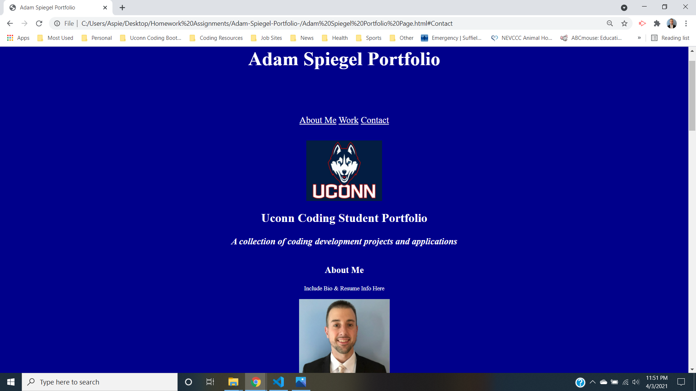

# **Adam Spiegel Portfolio README**

## Project Description & Goals
   The project goal(s) for this assignment were to develop a functional portfolio page to display our applications and projects throughout the Uconn Coding Bootcamp. This portfolio page was to be developed to showcase our skills and talents to future employers, while staying in a organized and presentable layout.

   This portfolio page will also host several live applications and projects to be included as our course work progresses.

## Action Items 

    1  Develop HTML 5 doc from scratch, including adding in all content to be displayed on our portfolio page.

    2  The content of the HTML was to be seperated into a head/header, body, main, sections and a footer/contact info.

    3 Content of portfolio page to include 3 main compnents, "About Me", "Work" and "Contact".

    4 Portfolio Page needed to include a head/shot or professional photo image attached.

    5 Links needed to be included which brought the user to those specific sections of the portfolio page (About Me, Work and Contact).

    6 Upon project completion, links of those projects needed to be live and take you that direct page.

    7 "Highlight" portfolio application needed to be presented at the top of the page, larger than the other projects below it.  

    8 Finally, media queries had to be implemented in your CSS, in order for your portfolio to be viewable when resized among all screen sizes.  

 

 

# Contact Information
* Email - AdamSpiegel23@gmail.com
* GitHub - https://github.com/AdamSpiegel
* LinkedIn - www.linkedin.com/in/adam-spiegel-3086687

